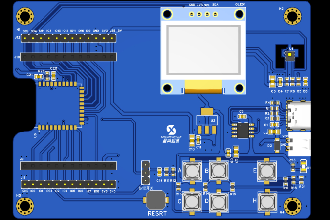

# Xinghongpai NearLink Dev Board

[简体中文](README.md) · [Original project](https://p.eda.cn/d-1328625634846441472) · [Hardware](hardware/) · [Firmware examples](firmware/) · [Source manifest](downloads/MANIFEST.md) · [Contributing](CONTRIBUTING.md)

Xinghongpai is an open-source development board based on the HiSilicon **WS63V100 / Hi3863** platform. It supports **NearLink SLE**, Wi-Fi and BLE for OpenHarmony learning, IoT prototypes, smart appliances, environmental sensing and embedded education. This repository exposes the KiCad schematic and PCB sources, BOM, and OpenHarmony / Hi3863 firmware examples directly in Git.

> This repository organizes public materials from the Huaqiu Open Hardware Community project. The exact CERN-OHL variant for the hardware has not been confirmed. Read the [license notes](#license-notes) before manufacturing, modifying or commercially reusing the design.

## At a glance

| Item | Details |
| --- | --- |
| Main platform | HiSilicon WS63V100 / Hi3863 series |
| Wireless | NearLink SLE, Wi-Fi, BLE |
| Software target | OpenHarmony / Hi3863 examples |
| On-board resources | 0.96-inch OLED, 6 user buttons, reset button, temperature and humidity module |
| Open hardware assets | KiCad project, schematic, PCB and BOM |
| PCB information | Approximately 96 mm × 70 mm, 2 layers (from the original project page) |

## Repository contents

| Resource | Location | Status |
| --- | --- | --- |
| Schematic and PCB sources | [`hardware/kicad/`](hardware/kicad/) | Tracked directly in Git |
| Bill of materials | [`hardware/bom/`](hardware/bom/) | XLSX included |
| OpenHarmony / Hi3863 examples | [`firmware/examples/`](firmware/examples/) | Requires an external SDK tree |
| Original source URLs and checksums | [`downloads/MANIFEST.md`](downloads/MANIFEST.md) | URL, size and SHA256 recorded |
| Project facts and provenance | [`PROJECT_FACTSHEET.md`](PROJECT_FACTSHEET.md) | Included |
| Import changes | [`CHANGES_FROM_ORIGINAL.md`](CHANGES_FROM_ORIGINAL.md) | Included |

The original page mentions Gerber files, but no standalone Gerber package was present in the PCB archive used for the first import. This repository does not claim that a mentioned asset is already available.

## Getting started

### Hardware

1. Download the `.kicad_pro`, `.kicad_sch` and `.kicad_pcb` files from [`hardware/kicad/`](hardware/kicad/).
2. Open the project in KiCad and cross-check the schematic, PCB, [`BOM`](hardware/bom/) and physical board revision before reproduction.
3. Re-run ERC/DRC and manually review footprints, substitutions, power and RF design before generating fabrication outputs.

### Firmware

1. Read [`firmware/README.md`](firmware/README.md); the examples are not a standalone SDK project.
2. Prepare a compatible OpenHarmony / Hi3863 (WS63) SDK tree.
3. Start with GPIO, timers, AHT20 or OLED before moving to Wi-Fi, TCP/UDP and integrated examples.
4. When reporting a problem, include the SDK/OpenHarmony version, example path, full build log and board revision.

The repository does not yet contain a maintainer-verified universal build command, so this README deliberately avoids inventing one. Reproducible setup documentation is welcome.

## Example areas

The imported examples cover threads, timers, mutexes, semaphores, message queues, GPIO, AHT20, ADC, OLED, Wi-Fi, TCP/UDP, fans, flame sensing, traffic lights, relays and temperature/humidity applications. See [`firmware/examples/`](firmware/examples/) for the source of truth.

Suggested entry points:

- [`11_aht20`](firmware/examples/11_aht20/): AHT20 temperature and humidity sensor
- [`13_adclight`](firmware/examples/13_adclight/): ADC light sensing
- [`14_easy_wifi`](firmware/examples/14_easy_wifi/): Wi-Fi station and hotspot
- [`201_oled`](firmware/examples/201_oled/): OLED display

## License notes

This mixed hardware, firmware and third-party-material repository cannot safely be covered by a single unverified license statement:

- The original project page shows “CERN Open Hardware License” but does not identify the CERN-OHL-S, W or P variant.
- The page body separately mentions Apache 2.0 and commercial reuse, creating an unresolved inconsistency.
- Many firmware files retain Apache-2.0 notices from HiHope Open Source Organization, HiSilicon and other upstream sources.
- Vendor documents, SDKs, tools and original archives may carry their own upstream terms.

Before redistribution, manufacturing or commercial use, read [`LICENSE`](LICENSE) and [`LICENSES/README.md`](LICENSES/README.md), preserve existing notices, and obtain confirmation of the hardware license variant from the project owner.

## Contributing

Use the hardware or firmware Issue template and include the board revision, SDK/OpenHarmony version, evidence and reproduction steps. Read [`CONTRIBUTING.md`](CONTRIBUTING.md) before submitting a Pull Request. Do not publish credentials or production secrets; see [`SECURITY.md`](SECURITY.md).

## Source and discovery terms

Original project: [Xinghongpai NearLink Development Board](https://p.eda.cn/d-1328625634846441472) on the Huaqiu Open Hardware Community.

Related terms: NearLink, SLE, SparkLink, Xinghongpai, WS63, WS63V100, Hi3863, HiSilicon, OpenHarmony, open-source hardware, development board, schematic, PCB, BOM and KiCad.
